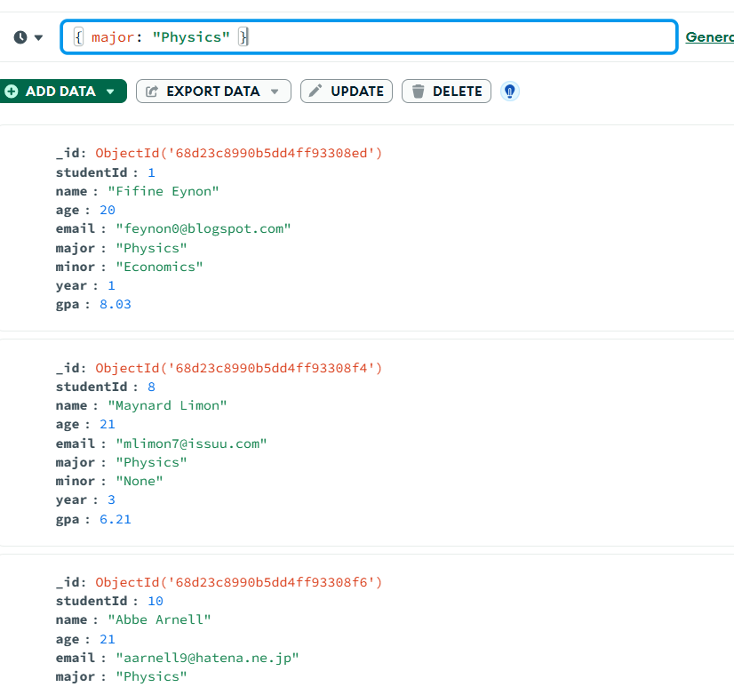

# Dataset
The dataset used is students.csv which is a synthetic collection of 100 students

---
## ⚙️ CRUD Operations

### 1. Create: Add a New Student
Adds a new student named "Aarav Patel" to the collection.

**Query:**
```javascript

db.student.insertOne({
  studentId: 101,
  name: "Aarav Patel",
  age: 21,
  email: "aarav.patel@example.com",
  major: "Computer Science",
  minor: "Statistics",
  year: 3,
  gpa: 8.85
});
```

**Result:**


### 2. Read: Find all Physics Majors
Retrieves all student documents where the major is "Physics".

**Query:**
```javascript

db.student.find({ "major": "Physics" });
```

**Result:**


### 3. Update: Modify a Student's Minor and GPA
Finds student with ID 42 and updates their minor and GPA.

**Query:**
```javascript
// mongo/queries/crud.js

db.student.updateOne(
  { "studentId": 42 },
  { 
    $set: { 
      "minor": "Data Science",
      "gpa": 9.1 
    } 
  }
);
```

**Result:**


### 4. Delete: Remove a Student
Removes the student with ID 78 from the collection.

**Query:**
```javascript
// mongo/queries/crud.js

db.student.deleteOne({ "studentId": 78 });
```

**Result:**


---

## 📊 Data Analysis (Aggregations)

### Analysis 1: Count Students per Year
This pipeline counts how many students are in each year of study.

**Query:**
```javascript

[
  {
    '$group': {
      '_id': '$year', 
      'numberOfStudents': {
        '$sum': 1
      }
    }
  }, {
    '$sort': {
      '_id': 1
    }
  }
]
```

**Result:**


### Analysis 2: Average GPA per Major
This pipeline calculates the average GPA for each major.

**Query:**
```javascript

[
  {
    '$group': {
      '_id': '$major', 
      'averageGPA': {
        '$avg': '$gpa'
      }
    }
  }, {
    '$sort': {
      'averageGPA': -1
    }
  }
]
```

**Result:**


### Analysis 3: Top 5 Computer Science Students by GPA
This pipeline finds the top 5 performing students in the "Computer Science" major.

**Query:**
```javascript

[
  {
    '$match': {
      'major': 'Computer Science'
    }
  }, {
    '$sort': {
      'gpa': -1
    }
  }, {
    '$limit': 5
  }
]
```

**Result:**
